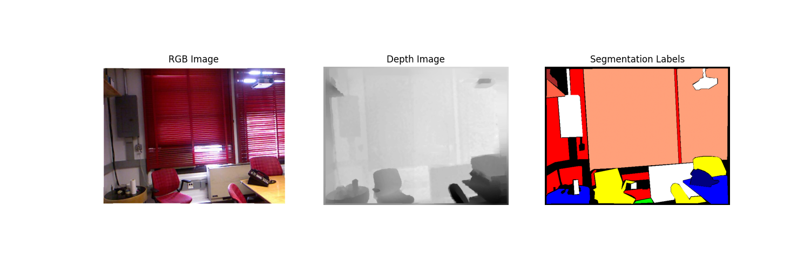
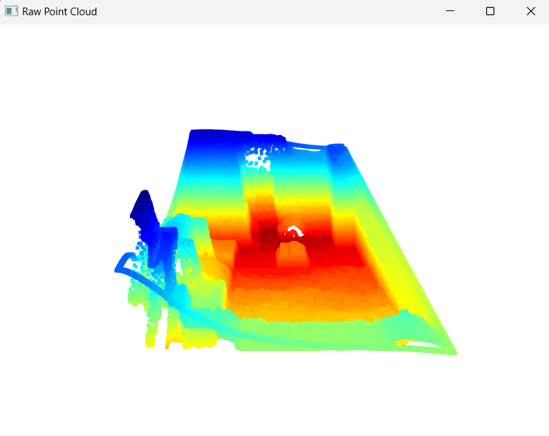
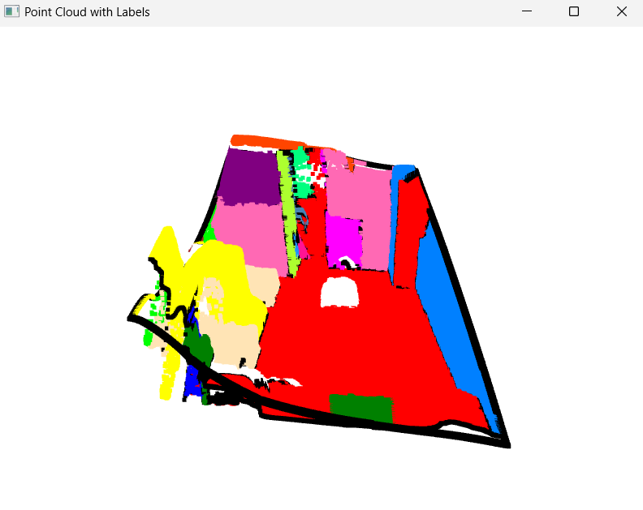

# 3D-PointNet-Semantic-Segmentation-NYUDepthV2

This project uses [PointNet](https://arxiv.org/abs/1612.00593) architecture to perform 3D point cloud semantic segmentation on data generated from the NYU Depth V2 dataset. The dataset includes paired RGB images and Depth maps that are combined to create 3D point clouds. The goal is to classify each point in the cloud into a semantic category (e.g., wall, chair, floor, etc.).

## Dataset
We use the NYU Depth V2 dataset, which provides RGB and Depth image pairs for indoor scenes. The labeled version (~2.8GB) is used to train and test the model. The dataset is available [here](https://cs.nyu.edu/~fergus/datasets/nyu_depth_v2.html).


## Project Pipeline

### 1. Data Preparation

RGB and Depth images are combined to generate 3D point clouds.
Each point is labeled with a semantic category based on the RGB values.



### 2. Point Cloud Generation
A script is provided to convert the RGB-D images into 3D point clouds. These point clouds are then labeled using the corresponding color information from the images.

### 3. Data Splitting
The generated point clouds are split into train, validation, and test sets:

- 70% training
- 15% validation
- 15% testing

### 4. Model Training
The project uses the PointNet architecture for 3D point cloud semantic segmentation. Training is performed on the generated point clouds with labeled points. The model is trained using a combination of Focal Loss and Dice Loss.

### 5. Inference
An inference script is included to test the trained model on new point clouds. 

### 6. Data Visualization
The point clouds can be visualized using Open3D. A script is provided to visualize both raw point clouds and the ones with predicted labels.

## Classes
There are 50 semantic categories in total. A file named classes.txt contains the full list of classes.

## Installation

### 1. Clone the repository:

```bash
git clone https://github.com/yourusername/3D-PointNet-Semantic-Segmentation-NYUDepthV2.git
cd 3D-PointNet-Semantic-Segmentation-NYUDepthV2
```

### 2. Install the required packages:

```bash
pip install -r requirements.txt
```

## How to run

### 1. Generate Point Cloud data from RGB and Depth map:

```bash
python dataset_gen.py
```

### 2. Visualize the Point cloud - both raw and semantic labelled point cloud

```bash
python data_viz.py
```





### 3. Split the generated data into train, val and test splits for training:

```bash
python dataset_split.py
```

### 4. Run the training script to train the PointNet model:

```bash
python train.py
```

### 5. Run Inference

```bash
python inference.py
```

## Results

During training, metrics like accuracy, loss, IoU (Intersection Over Union), and MCC (Matthews Correlation Coefficient) will be tracked and displayed.


